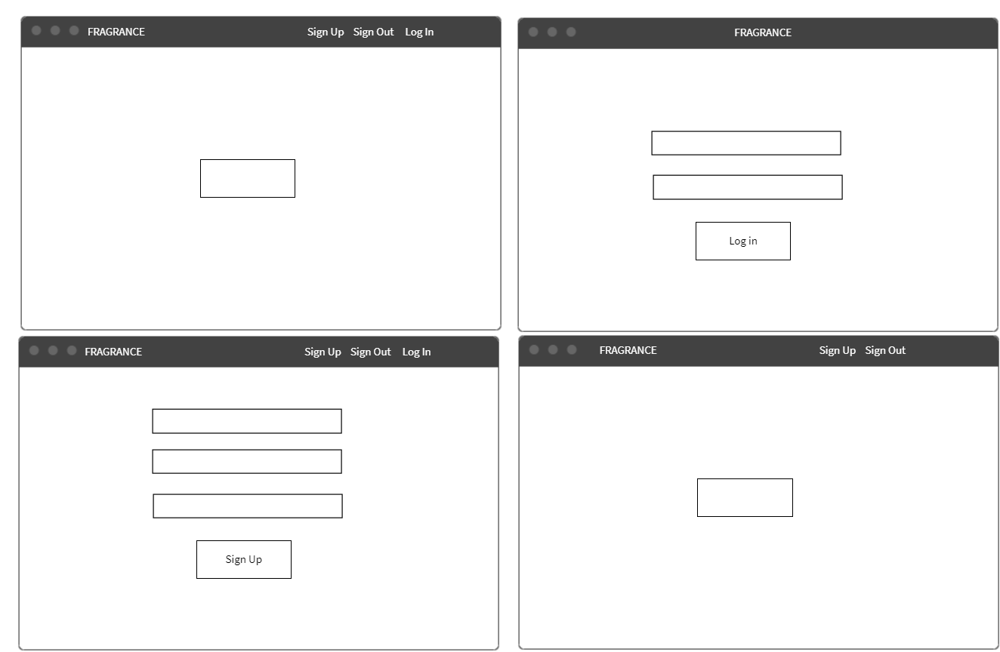
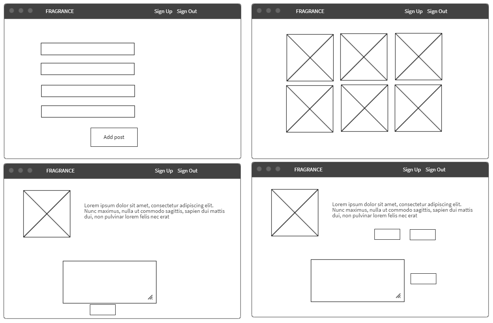

# FRAGRANCE BLOG

## General info :
- FRAGRANCE is a blog that displaying information about perfumes where a user or even a group of users share their views .
## User Stories
### User stories (Users):
* As an user I can sing up
* As an user I can log in
* As an user I can log out
* As a user I can add a comment
* As a user I can delete a comment
* As a user I can disply posts
### User stories (Admin):
* As an admin I can sing up
* As an admin I can log in
* As an admin I can log out
* As an admin I can add new posts
* As an admin I can edit posts
* As an admin I can delete posts
* As an admin I can add new posts
## Wire Frames :

## ER Diagram

## Technologies
#### The project was created with:
* Ruby - version 2.6.5
* Rails - version 5.2.4.2
* Sqlit3
* Devise
* Bootstrap
## Features
### List of features for future development :
### Features
* Add categories
* Add the ability to search within the blog
* improvement design 

